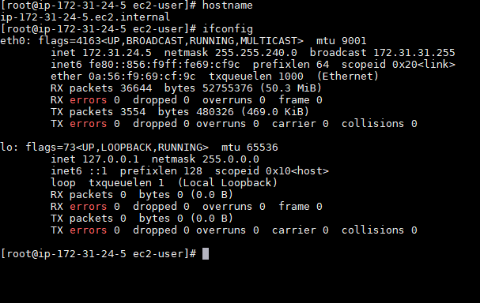
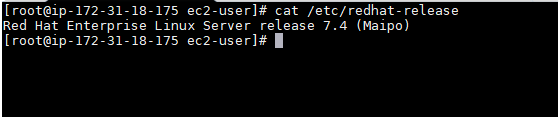
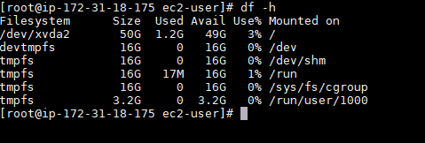
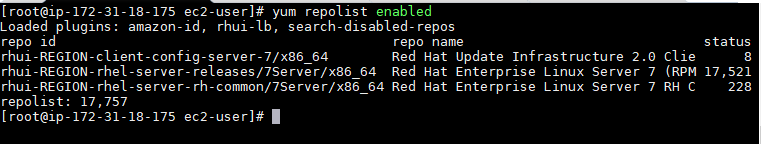
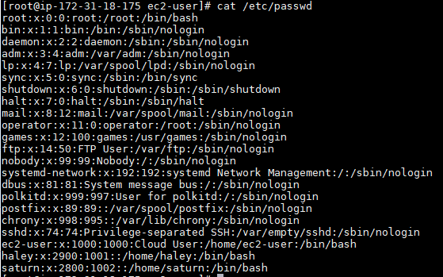
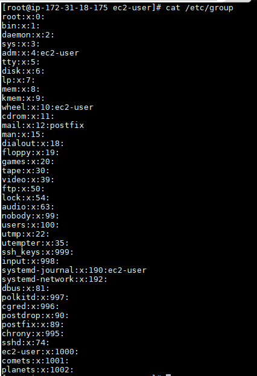

# Challenge Setup #

----------

## 1. List the cloud provider you are using (AWS, GCE, Azure, CloudCat, other) ##

- AMAZON(AWS)

## 2. List your instances by IP address and DNS name (don't use /etc/hosts for this) ##

1. **Master**

	- hostname Interno:   	ip-172-31-18-175.ec2.internal
	- ip interna:			172.31.18.175 
1. **Worker1**

	- hostname Interno:   	ip-172-31-28-107.ec2.internal
	- ip interna:			172.31.28.107 
1. **Worker2**

	- hostname Interno:   	ip-172-31-16-231.ec2.internal
	- ip interna:			172.31.16.231  
1. **Worker3**

	- hostname Interno: 	ip-172-31-24-5.ec2.internal

	- ip interna:			172.31.24.5 

Ejemplo de comandos usados:

## 3. List the Linux release you are using ##

## 4. List the file system capacity for the first node ##

## 5. List the command and output for yum repolist enabled ##

## Add the following Linux accounts to all nodes ##

	User saturn with a UID of 2800
	User haley with a UID of 2900
	Create the group comets and add haley to it
	Create the group planets and add saturn to it

----------

    groupadd comets
    groupadd planets
    useradd haley -u 2900 -g comets -p password
    useradd saturn -u 2800 -g planets -p password

## List the /etc/passwd entries for saturn and haley ##

 
## List the /etc/group entries for comets and planets ##

 

