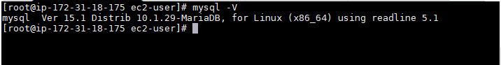
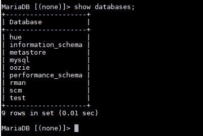

# MariaDB #

----------

### A command and output that shows the hostname of your database server ###
 

### A command and output that reports the database server version ###
 

### A command and output that lists all the databases in the server ###
 