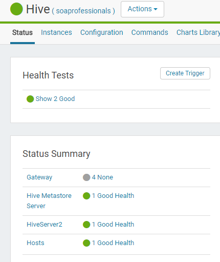

# CM Monitoring Lab #

----------

## 1.- What is ubertask optimization? ##

Se utiliza esta optimización para permitir que el cluster ejecute jobs "suficientemente pequeño" con una sola JVM

Esta propiedad puede ser cambiada en la categoría de Performance. El nombre de la propiedad es *mapreduce.job.ubertask.enable*

## 2.- Where in CM is the Kerberos Security Realm value displayed? ##

1. In the Cloudera Manager Admin Console, select Administration Settings.
1. Click the Security category, and enter the Kerberos realm for the cluster in the Kerberos Security Realm field (for example, YOUR-LOCAL-REALM.COM or YOUR-SUB-REALM.YOUR-LOCAL-REALM.COM) that you configured in the krb5.conf file.

Fuente: 
> http://www.cloudera.com/documentation/manager/5-1-x/Configuring-Hadoop-Security-with-Cloudera-Manager/cm5chs_kerb_def_realm_s6.html

## 3.- Which CDH service(s) host a property for enabling Kerberos authentication? ##

- HDFS
- YARN
- Impala
- Hive
- Spark on YARN 
- Sentry
- Cloudera Management Service 

Fuente:
> https://www.cloudera.com/documentation/enterprise/5-11-x/topics/sg_custom_principals.html#xd_583c10bfdbd326ba--69adf108-1492ec0ce48--7c0f__section_dzq_n54_js

## 4.- How do you upgrade the CM agents? ##

Upgrade the Cloudera Manager Agent. You can use an upgrade wizard that is invoked when you connect to the Admin Console or manually install the Cloudera Manager Agent packages.

Fuente:
> https://www.cloudera.com/documentation/enterprise/5-5-x/topics/cm_ag_upgrading_cm.html
> 

## 5.- Give the tsquery statement used to chart Hue's CPU utilization? ##

	select cpu_system_rate + cpu_user_rate where category=ROLE and serviceName=hue

## 6.- Name all the roles that make up the Hive service ##

- Hive Metastore Server
- HiveServer2

----------

## 7.- What steps must be completed before integrating Cloudera Manager with Kerberos? ##

- Set up a working KDC. Cloudera Manager supports authentication with MIT KDC and Active Directory.
Configure the KDC to allow renewable tickets with non-zero ticket lifetimes.

- Active Directory allows renewable tickets with non-zero lifetimes by default. You can verify this by checking Domain Security Settings > Account Policies > Kerberos Policy in Active Directory.
- For MIT KDC, make sure you have the following lines in the kdc.conf.

		max_life = 1d  
		max_renewable_life = 7d
		kdc_tcp_ports = 88

- If you are using Active Directory, make sure LDAP over TLS/SSL (LDAPS) is enabled for the Domain Controllers.
- Install the following packages on your cluster depending on the OS in use. 

OS 	Packages to be Installed
RHEL/CentOS 5, RHEL/CentOS 6 	

    openldap-clients on the Cloudera Manager Server host
    krb5-workstation, krb5-libs on ALL hosts

SLES 	

    openldap2-client on the Cloudera Manager Server host
    krb5-client on ALL hosts

Ubuntu or Debian 	

    ldap-utils on the Cloudera Manager Server host
    krb5-user on ALL hosts

Windows 	

    krb5-workstation, krb5-libs on ALL hosts

- Create an account for Cloudera Manager that has the permissions to create other accounts in the KDC. 

Fuente: 
> https://www.cloudera.com/documentation/enterprise/5-6-x/topics/cm_sg_s4_kerb_wizard.html#concept_ssg_x5y_l4

