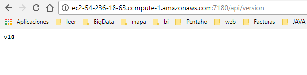

# Upgrade Cloudera Manager #

----------

## Report the latest available version of the API ##

    http://ec2-54-236-18-63.compute-1.amazonaws.com:7180/api/version

	

----------

----------

## Report the CM version ##
Comando

    http://ec2-54-236-18-63.compute-1.amazonaws.com:7180/api/v18/cm/version

Salida

    {
      "version" : "5.13.0",
      "buildUser" : "jenkins",
      "buildTimestamp" : "20171002-1719",
      "gitHash" : "bd657e597e6743c458ee2c9aabe808b7c972981c",
      "snapshot" : false
    }
    

## List all CM users ##

Comando

    http://ec2-54-236-18-63.compute-1.amazonaws.com:7180/api/v18/users

Salida

	{
	  "items" : [ {
	"name" : "admin",
	"roles" : [ "ROLE_LIMITED" ]
	  }, {
	"name" : "minotaur",
	"roles" : [ "ROLE_CONFIGURATOR" ]
	  }, {
	"name" : "soaprofessionals",
	"roles" : [ "ROLE_ADMIN" ]
	  } ]
	}

## Report the database server in use by CM ##
Comando

    {
      "scmDbType" : "MYSQL",
      "embeddedDbUsed" : false
    }
Salida

    {
      "scmDbType" : "MYSQL",
      "embeddedDbUsed" : false
    }
    
