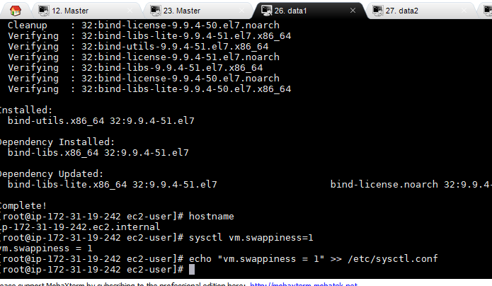
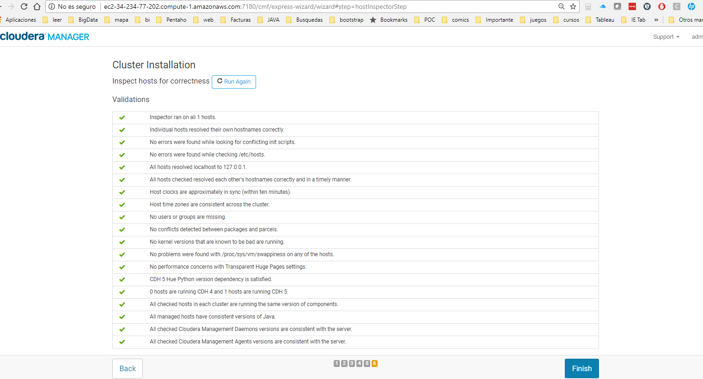

# **Prerequisitos** #

----------

## 1.- Check vm.swappiness on all your nodes ##
 

    cat /proc/sys/vm/swappiness

- Set the value to 1 if necessary
	        sysctl vm.swappiness=1
	    
	    echo "vm.swappiness = 1" >> /etc/sysctl.conf
    
Esta es la imagen de la ejecución del comando:

## 2.- Show the mount attributes of your volume(s) ##

   
		[ec2-user@ip-172-31-30-163 ~]$ df -h
		Filesystem      Size  Used Avail Use% Mounted on
		/dev/xvda2       50G   13G   38G  26% /
		devtmpfs         16G     0   16G   0% /dev
		tmpfs            16G     0   16G   0% /dev/shm
		tmpfs            16G   25M   16G   1% /run
		tmpfs            16G     0   16G   0% /sys/fs/cgroup
		tmpfs           3.2G     0  3.2G   0% /run/user/0
		cm_processes     16G   22M   16G   1% /run/cloudera-scm-agent/process
		tmpfs           3.2G     0  3.2G   0% /run/user/997
		/dev/xvdb        50G   29G   21G  58% /dfs/dn
		tmpfs           3.2G     0  3.2G   0% /run/user/1000
		[ec2-user@ip-172-31-30-163 ~]$

## 3.- If you have ext-based volumes, list the reserve space setting ##

No tengo ext-based

- XFS volumes do not support reserve space

## 4.-Disable transparent hugepage support ##

    echo never > /sys/kernel/mm/transparent_hugepage/defrag 
    echo never > /sys/kernel/mm/transparent_hugepage/enabled

 to disable this, and then add the same command to an init script such as /etc/rc.local so it will be set on system reboot

	[ec2-user@ip-172-31-30-163 ~]$ cat /sys/kernel/mm/transparent_hugepage/enabled
	[always] madvise never
	[ec2-user@ip-172-31-30-163 ~]$ cat /sys/kernel/mm/transparent_hugepage/defrag
	[always] madvise never
	[ec2-user@ip-172-31-30-163 ~]$

## 5.-List your network interface configuration ##

	[ec2-user@ip-172-31-30-163 ~]$ ifconfig
	eth0: flags=4163<UP,BROADCAST,RUNNING,MULTICAST>  mtu 9001
	        inet 172.31.30.163  netmask 255.255.240.0  broadcast 172.31.31.255
	        inet6 fe80::8c7:7bff:fe09:5d7c  prefixlen 64  scopeid 0x20<link>
	        ether 0a:c7:7b:09:5d:7c  txqueuelen 1000  (Ethernet)
	        RX packets 5739840  bytes 1122854065 (1.0 GiB)
	        RX errors 0  dropped 0  overruns 0  frame 0
	        TX packets 10268550  bytes 62997672598 (58.6 GiB)
	        TX errors 0  dropped 0 overruns 0  carrier 0  collisions 0
	
	lo: flags=73<UP,LOOPBACK,RUNNING>  mtu 65536
	        inet 127.0.0.1  netmask 255.0.0.0
	        inet6 ::1  prefixlen 128  scopeid 0x10<host>
	        loop  txqueuelen 1  (Local Loopback)
	        RX packets 14207089  bytes 143440594568 (133.5 GiB)
	        RX errors 0  dropped 0  overruns 0  frame 0
	        TX packets 14207089  bytes 143440594568 (133.5 GiB)
	        TX errors 0  dropped 0 overruns 0  carrier 0  collisions 0

## 6.-Show that forward and reverse host lookups are correctly resolved ##

- For /etc/hosts, use getent- 
- For DNS, use nslookup

		[ec2-user@ip-172-31-30-163 ~]$ nslookup ip-172-31-30-163.ec2.internal
		Server:         172.31.0.2
		Address:        172.31.0.2#53
		
		Non-authoritative answer:
		Name:   ip-172-31-30-163.ec2.internal
		Address: 172.31.30.163

Pantalla de Prerequisitos de cloudera Manager

